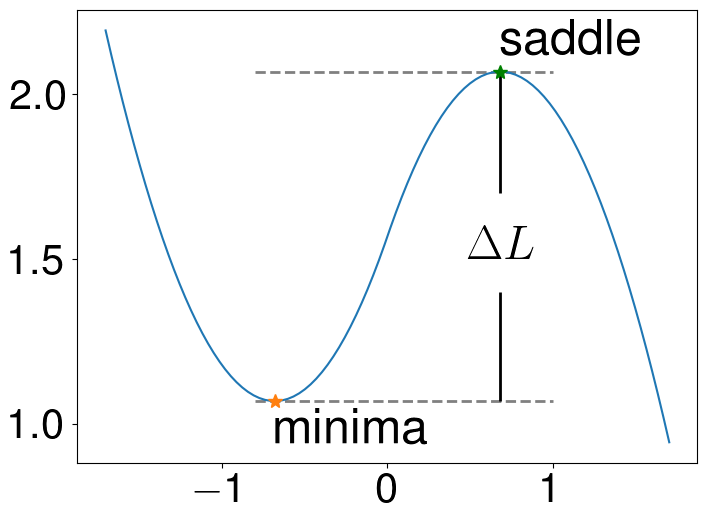
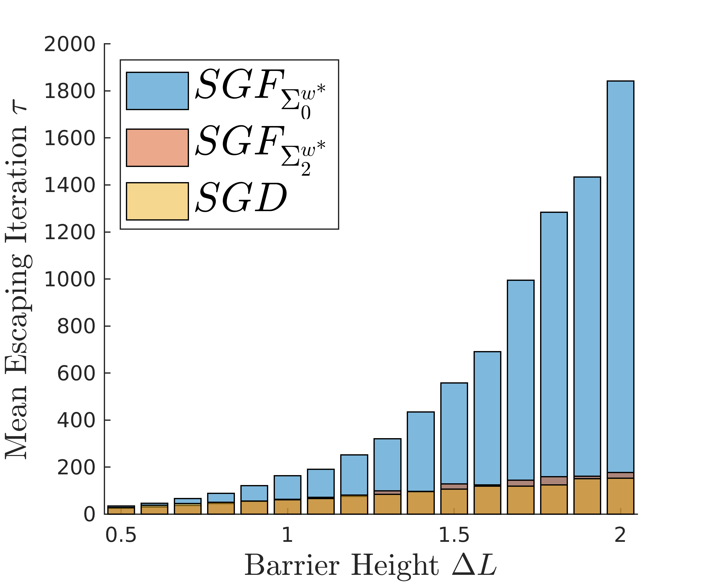
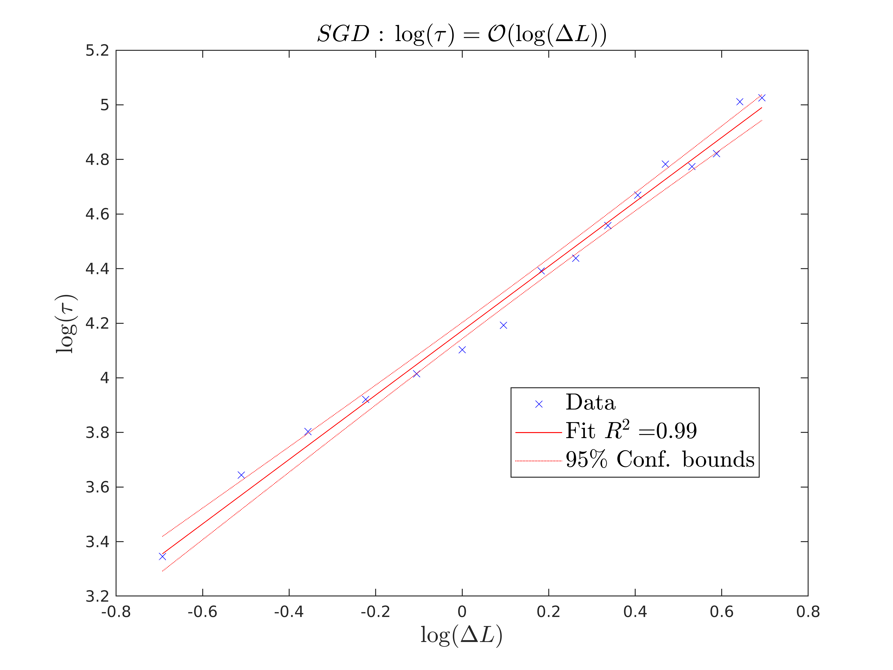
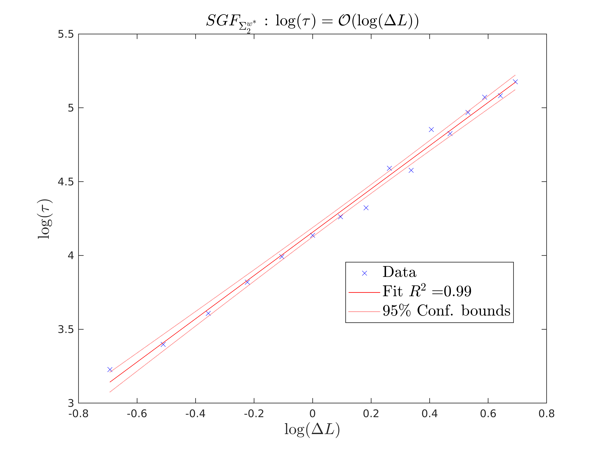
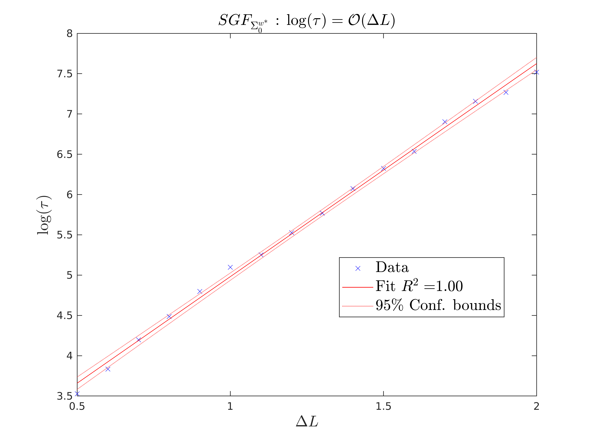

## One-Dimensional Model

We design a 1-dimensional model that has loss function
    

where   ,   ,    and    is a hyperparameter. We can adjust barrier height    by parameter    without changing the Hessian at minima and saddle point. 

The curve of    with    is plotted below.

We set barrier height    as   . For each height, we train the model by    and the Euler-Maruyama discretization of    and   , and record the total number of the iteration when the model firstly escaped from the local minimum bypassing the saddle point. We repeat the training for 300 rounds for every selected barrier height and report the averaged escaping time in following figure.

<!-- 

 -->
As shown above,    can mimic the escaping behavior of   , and the averaged escaping time of    grows in polynomial order of the barrier height    which matches the theoretical result for    while that of    grows in exponential order.

To explicitly show this, we conduct regressions between mean escaping time, which is denoted as   , and barrier height   . The results are shown below, from which we can observe that the R-square of these regressions are very high (  ) and thus all of them are well fitted. From the results,    holds for both    and   , which means    and therefore the mean escaping time of    and    grows in polynomial order; For   , we have    that means   , which is exponential order.

     :          |     :             |    :   
-------------------------|-------------------------|-------------------------
  |   |  

